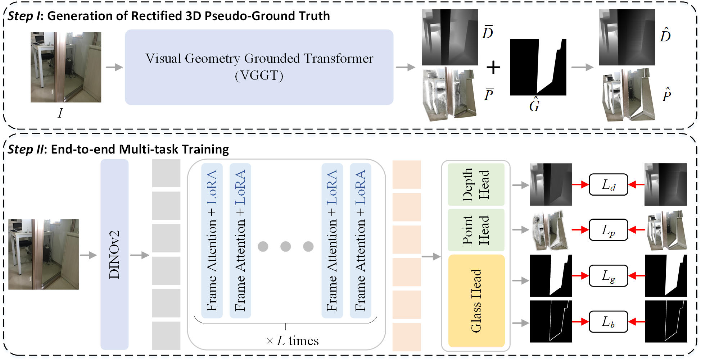

# (ACMMM 2026) Glass Surface Detection Grounded in 3D Visual Geometry

## Abstract

Glass surface detection (GSD) is critical for scene understanding and reconstruction, yet remains challenging due to the transparency and reflectivity of glass surfaces. Existing GSD methods typically rely on 2D appearance cues, which may fail in geometrically ambiguous scenes.
In this paper, we propose a paradigm shift: grounding GSD in 3D visual geometry to explicitly model the physical existence of glass surfaces.
Our method first distills rich 3D priors from the visual geometry grounded transformer (VGGT) and generates glass-aware 3D representations. It then exploits multi-tasking learning with a novel glass detection head, consisting of two core modules: 
a Frequency Self-Attention Module (FSAM) that identifies glass-specific spectral features for glass surface localization, and a Geometry Grounding Block (GeGB) that selectively grounds 2D features in 3D geometry for glass surface segmentation.
Extensive experiments demonstrate that our method achieves state-of-the-art performance across seven standard GSD benchmarks, generalizes well to video/multi-modal data, and substantially improves reconstruction in glass scenes.

## Pipeline

## To Do

We will improve the project as soon as possible.

## Acknowledgements

We appreciate [VGGT](https://github.com/facebookresearch/vggt) for being open source and contributing.